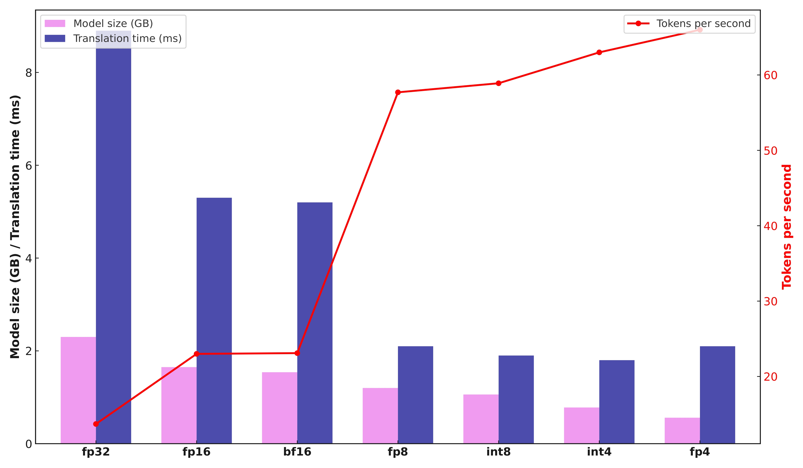

# Bhasha-Rupantarika
**Algorithm-Hardware Co-design approach for Multi-lingual Neural Machine Translation**

[](https://choosealicense.com/licenses/mit/)
[](https://www.python.org/downloads/)
[](https://jupyter.org/)
[](https://en.wikipedia.org/wiki/SystemVerilog)

> *Bhasha-Rupantarika* (भाषा-रूपान्तरिका) means "Language Transformer" in Sanskrit, representing our mission to bridge linguistic barriers through innovative hardware-software co-design.
<p align="center">
  <a href="https://mukullokhande99.github.io/Bhasha-Rupantarika/">
    
  </a>
</p>

  


## 🚀 Overview

Bhasha-Rupantarika is a comprehensive research project that explores **algorithm-hardware co-design** methodologies for efficient multilingual neural machine translation (NMT). This project addresses the computational challenges of deploying high-quality translation models by optimizing both software algorithms and hardware architectures.

### 🎯 Key Features

- 🔧 **Hardware-Software Co-optimization**: Integrated design approach for NMT acceleration
- 🌐 **Multilingual Support**: Focused on Indian languages and cross-lingual translation
- ⚡ **Performance Optimization**: Quantization, pruning, and hardware-aware optimizations
- 📱 **Edge Deployment**: Efficient inference on resource-constrained devices
- 🔬 **Research-Grade Implementation**: Comprehensive evaluation and benchmarking

  <table>
  <tr>
    <td></td>
    <td></td>
    <td></td>
  </tr>
</table>


## 📊 Performance Highlights

| Metric | Achievement |
|--------|-------------|
| **BLEU Score** | 30.2+ (Multilingual) |
| **Model Compression** | 8x reduction with INT4 quantization |
| **Inference Speedup** | 2.25x faster inference |
| **Memory Efficiency** | 75% reduction in GPU memory usage |
| **Supported Languages** | 200+ language pairs via NLLB-200 |



## 🛠️ Installation & Setup

### Prerequisites

- Python 3.8 or higher
- CUDA 11.0+ (for GPU acceleration)
- Git
- SystemVerilog simulator (optional, for hardware components)

### Quick Installation
```bash
git clone https://github.com/mukullokhande99/Bhasha-Rupantarika.git
cd Bhasha-Rupantarika
pip install -r requirements.txt
```
### For Specific Language
Every supported language by nllb-200. Language code is provided for reference.
[Language code list](nllb_languages.pdf) 

## 📊 Hardware Requirements

### Minimum Requirements
- **CPU**: Intel i5 or AMD Ryzen 5
- **RAM**: 8 GB
- **GPU**: NVIDIA L4 
- **Storage**: 10 GB free space
---

**🌟 Star this repository if you find it helpful! 🌟**

